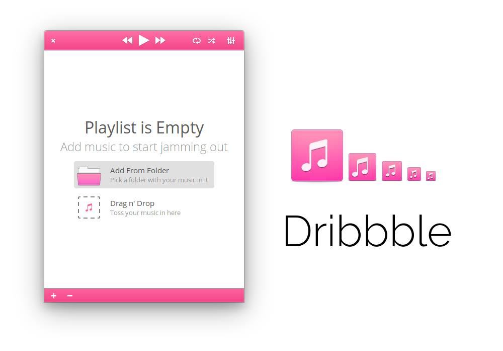

# Dribbble

A music player writen in Vala and GTK+



## Build

1. Install required dependencies:
```bash
sudo apt-get install libgstreamer1.0-dev libgstreamer-plugins-base1.0-dev build-essential gettext libgirepository1.0-dev libglib2.0-dev libgtk-4-dev libgranite-dev meson cmake valac valadoc
```

2. Configure installation target directory and prepare the source code:
```bash
meson build --prefix=/usr
```

3. Compile the source code and install the app on your system:
```bash
cd build
ninja
ninja install
```

## Uninstall

To remove the application files from your system, run next command from the root of the project:
```bash
sudo ninja -C build uninstall
```